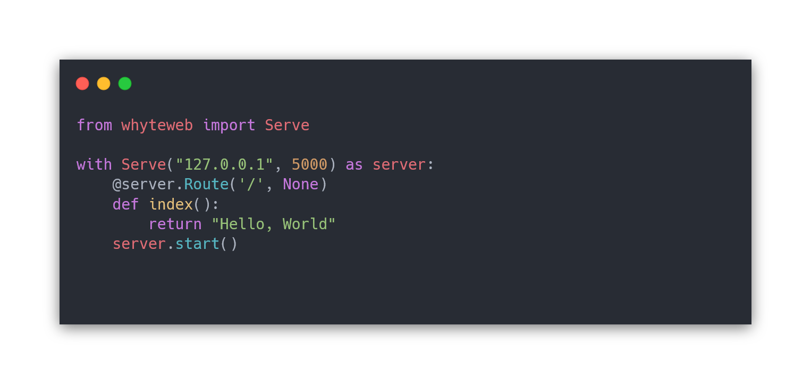

# WhyteWeb
WhyteWeb is an HTTP Server Library, written in Python, for idiots.

## Examples
A few code blobs using whyteweb.

- Starts a web server with the index route showing text saying "Hello, World".
